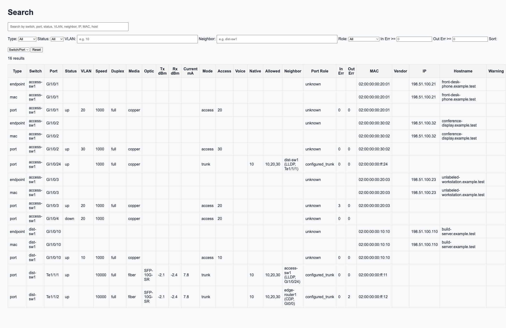
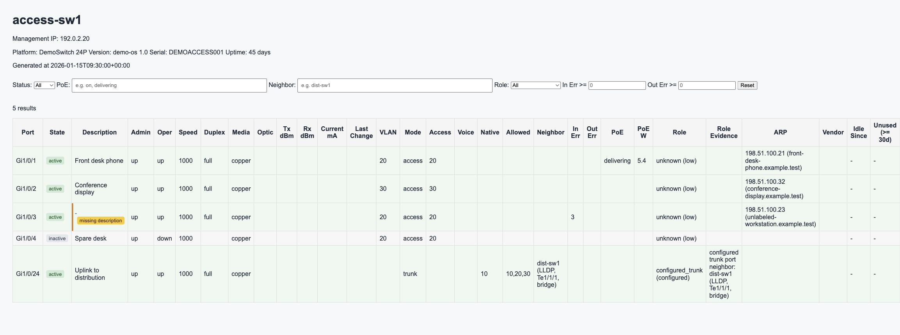

<!--
Copyright 2026 switchmappy
SPDX-License-Identifier: Apache-2.0

Licensed under the Apache License, Version 2.0 (the "License");
you may not use this file except in compliance with the License.
You may obtain a copy of the License at

    http://www.apache.org/licenses/LICENSE-2.0

This file was created or modified with the assistance of an AI (Large Language Model).
Review required for correctness, security, and licensing.
-->

# クイックスタートとユーザツアー

- English original: [onboarding.md](onboarding.md)
- 静的な英日UI: [index.html](index.html)

## クイックスタート

SNMPと検索UIの依存関係を含めてインストールします。

```bash
python -m venv .venv
source .venv/bin/activate
pip install -e .[snmp,search]
```

設定ファイルを作成します。

```bash
cp site.yml.example site.yml
```

最低限、1台のスイッチを `site.yml` に設定します。

```yaml
destination_directory: output
idlesince_directory: idlesince
maclist_file: maclist.json

switches:
  - name: access-sw1
    management_ip: 192.0.2.20
    collection_method: snmp
    vendor: generic
    snmp_version: 2c
    community: public
    trunk_ports: ["Gi1/0/24"]
```

ルータSNMPでARPを収集しない場合は、CSVからARP情報を取り込みます。

```bash
switchmap get-arp --source csv --csv arp.csv
```

静的レポートを生成し、検索UIを起動します。

```bash
switchmap build-html
switchmap serve-search --host 127.0.0.1 --port 8000
```

`http://127.0.0.1:8000/search/` を開きます。

## 機能ツアー

switchmappyは日常的なスイッチポート運用向けの静的HTMLを生成します。

- 収集成功/失敗を確認できるサイト概要
- スイッチ別のポート一覧
- 複数スイッチを横断する全ポート一覧
- MACとARPを使ったエンドポイント相関
- VLANサマリ
- 履歴と移動エンドポイントの確認
- 収集や相関の調査に使うデバッグ診断
- 生成済み `output/` を配信するローカル検索UI



## 設定項目ツアー

まず出力先と収集状態の保存先を決めます。

- `destination_directory`: 生成HTMLサイト。既定値は `output`
- `idlesince_directory`: idle-since状態。既定値は `idlesince`
- `maclist_file`: ARP/MACインベントリ。既定値は `maclist.json`
- `history_directory`: 過去スナップショット。既定値は `history`
- `collection_artifacts_directory`: 収集診断アーティファクト。既定値は `artifacts`
- `unused_after_days`: 未使用ポート判定日数。既定値は `30`
- `snmp_timeout` と `snmp_retries`: 収集タイミング制御

スイッチは `switches[]` に追加します。SNMPでは `name`、
`management_ip`、`snmp_version`、認証情報が必要です。SSHでは
`collection_method: ssh`、`ssh_username`、`ssh_password` または
`ssh_private_key` が必要です。

`switchmap get-arp --source snmp` でルータからARPを直接収集する場合は、
`routers[]` にルータを追加します。

## 起動方法ツアー

通常は次の順番で実行します。

```bash
switchmap scan-switch
switchmap get-arp --source csv --csv arp.csv
switchmap import-hostnames --csv hostnames.csv
switchmap build-html
switchmap serve-search --host 127.0.0.1 --port 8000
```

`scan-switch` はidle-since状態を更新します。`get-arp` はエンドポイント
インベントリを更新します。`import-hostnames` はホスト名を補完します。
`build-html` はスイッチ状態を収集して静的サイトを書き出します。
`serve-search` は生成済みサイトをローカル配信します。

## 操作方法ツアー

運用時は次の流れで使います。

- 概要ページで収集状態を確認する
- 検索画面でMACアドレス、IPアドレス、ホスト名、VLAN、ポート、近隣機器を探す
- スイッチ詳細でポート状態とエンドポイント根拠を確認する
- 全ポート画面で未使用、無効化、エラー、説明不足のポートを探す
- エンドポイント画面とVLAN画面でインベントリを確認する
- 履歴画面でエンドポイント移動やポート属性変更を確認する
- 収集や相関が期待と異なる場合はデバッグ診断を開く




## デモスクリーンショットの生成

このガイドのスクリーンショットは合成データだけで生成しています。ローカルで
デモサイトを再生成するには次を実行します。

```bash
python scripts/generate_onboarding_demo.py
switchmap serve-search --config docs/assets/onboarding/demo/site.yml
```

デモHTMLは `docs/assets/onboarding/demo/output/` に書き出されます。実機や
プライベートラボの出力でスクリーンショットを置き換えないでください。
