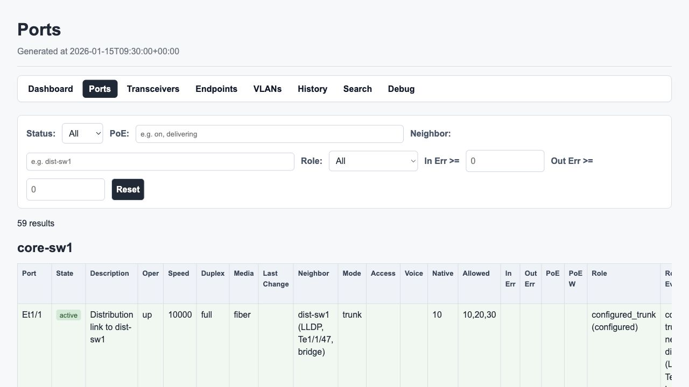
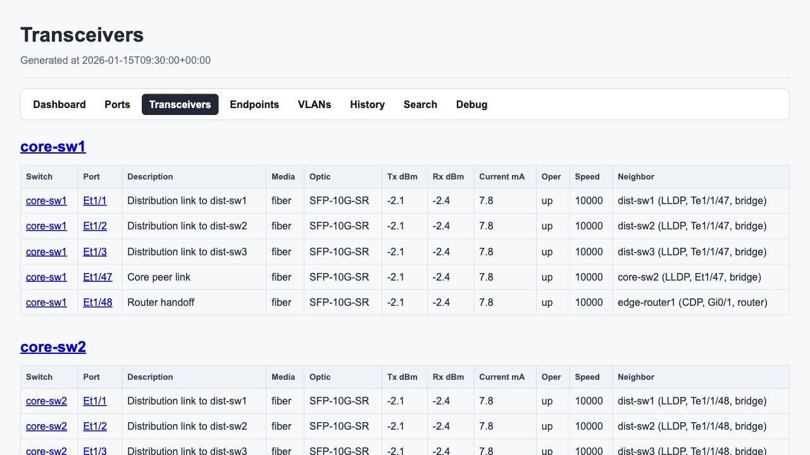
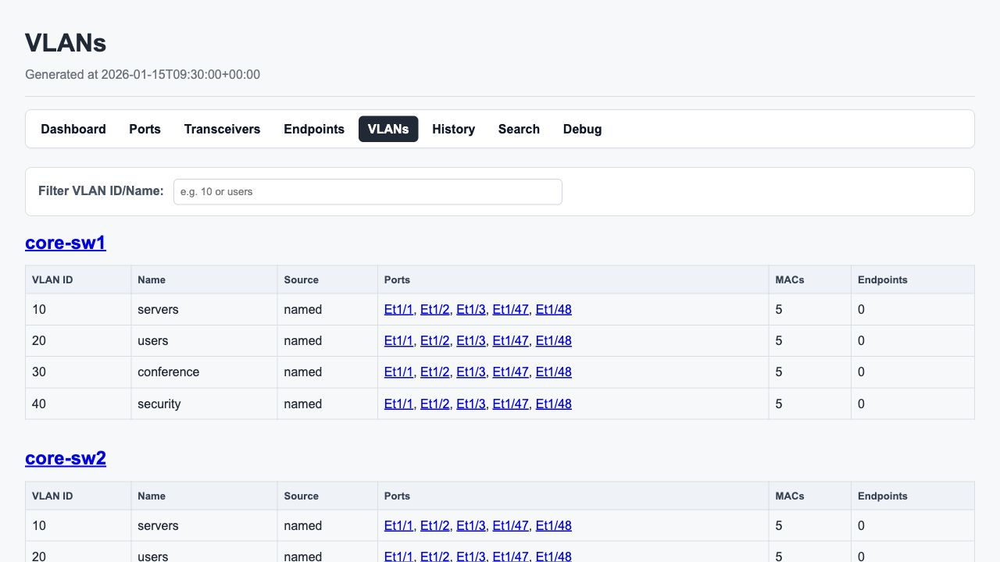

<!--
Copyright 2026 SwitchMappy
SPDX-License-Identifier: Apache-2.0

Licensed under the Apache License, Version 2.0 (the "License");
you may not use this file except in compliance with the License.
You may obtain a copy of the License at

    http://www.apache.org/licenses/LICENSE-2.0

This file was created or modified with the assistance of an AI (Large Language Model).
Review required for correctness, security, and licensing.
-->

# Quick Start and User Tour

- Japanese translation: [onboarding.ja.md](onboarding.ja.md)
- Static bilingual UI: <https://icecake0141.github.io/switchmappy/>
- Publishing notes: [GitHub Pages Documentation](pages.md)

## Before You Begin

SwitchMappy is based on Pete Siemsen's original
[Switchmap](https://switchmap.sourceforge.net/). The original Switchmap has a
classic web UI and is no longer actively updated, but it is still a remarkably
complete and functional tool. Many people have tried to carry the same idea
forward in Ruby, Python, and other modern implementations. SwitchMappy is one
more attempt to bring that great original back into active use for today's
network operations.

## Quick Start

Install SwitchMappy with SNMP and search support:

```bash
python -m venv .venv
source .venv/bin/activate
pip install -e .[snmp,search]
```

Create a configuration file:

```bash
cp site.yml.example site.yml
```

Edit `site.yml` with at least one switch:

```yaml
destination_directory: output
idlesince_directory: idlesince
maclist_file: maclist.json

switches:
  - name: access-sw1
    management_ip: 192.0.2.20
    collection_method: snmp
    vendor: generic
    snmp_version: 2c
    community: public
    trunk_ports: ["Gi1/0/24"]
```

Import ARP data from CSV when router SNMP collection is not configured:

```bash
switchmap get-arp --source csv --csv arp.csv
```

Build the static report and serve the search UI:

```bash
switchmap build-html
switchmap serve-search --host 127.0.0.1 --port 8000
```

Open `http://127.0.0.1:8000/search/`.

## Feature Tour

SwitchMappy creates static HTML pages for daily switch-port operations:

- site overview with successful and failed switch collection status,
- all-ports view for cross-switch scanning of link state, descriptions,
  endpoint evidence, errors, PoE, and unused-port candidates,
- dedicated transceiver diagnostics for optic model, Tx/Rx power, laser current,
  neighbor evidence, and uplink health review,
- VLAN summary that shows how access and trunk membership spans the site,
- per-switch port inventory with the same port, transceiver, VLAN, endpoint, and
  neighbor evidence in one place,
- endpoint correlation using MAC and ARP data,
- history and moved-endpoint review,
- debug diagnostics for collection and correlation troubleshooting,
- local search UI served from the generated `output/` directory.


The onboarding demo uses synthetic data for ten switches across three platform
families: core, distribution, and access. This makes the main report surfaces
large enough to show how operators scan patterns instead of reading a tiny
single-switch sample.







## Configuration Tour

Start with the top-level output and collection paths:

- `destination_directory`: generated HTML site, default `output`
- `idlesince_directory`: idle-since state, default `idlesince`
- `maclist_file`: ARP/MAC inventory, default `maclist.json`
- `history_directory`: previous snapshots, default `history`
- `collection_artifacts_directory`: collector diagnostics, default `artifacts`
- `unused_after_days`: threshold for unused-port labeling, default `30`
- `snmp_timeout` and `snmp_retries`: collection timing controls

Add switches under `switches[]`. SNMP mode needs `name`, `management_ip`,
`snmp_version`, and credentials. SSH mode needs `collection_method: ssh`,
`ssh_username`, and either `ssh_password` or `ssh_private_key`.

Add routers under `routers[]` when `switchmap get-arp --source snmp` should
collect ARP tables directly from routing devices.

## Startup Tour

Use these commands in the normal order:

```bash
switchmap scan-switch
switchmap get-arp --source csv --csv arp.csv
switchmap import-hostnames --csv hostnames.csv
switchmap build-html
switchmap serve-search --host 127.0.0.1 --port 8000
```

`scan-switch` updates idle-since state. `get-arp` updates endpoint inventory.
`import-hostnames` enriches endpoint names. `build-html` collects switch state
and writes the static site. `serve-search` hosts the generated site locally.

## Operation Tour

Use the report as an operational workflow:

- start on the overview page to confirm collection health,
- open search for a MAC address, IP address, hostname, VLAN, port, or neighbor,
- use the all-ports page first to find unused, disabled, errored, PoE-powered,
  undocumented, or endpoint-heavy ports across all switches,
- open the transceivers page to review uplink optics, Tx/Rx power, current, and
  neighboring network devices,
- use the VLAN page to confirm access/trunk membership for user, conference,
  security, and server networks,
- inspect switch detail pages when you need the per-switch version of port,
  endpoint, neighbor, PoE, and optic evidence,
- use endpoint pages for inventory review,
- check history when endpoints move or port attributes change,
- open debug diagnostics when collection or correlation data does not match expectations.


## Demo Screenshot Workflow

The screenshots in this guide are generated from synthetic data only. The
fixture renders ten switches across core, distribution, and access platforms. To
rebuild the demo site locally:

```bash
python scripts/generate_onboarding_demo.py
switchmap serve-search --config docs/assets/onboarding/demo/site.yml
```

The demo writes HTML under `docs/assets/onboarding/demo/output/`. Do not replace
the screenshots with private lab output or data from real devices.
